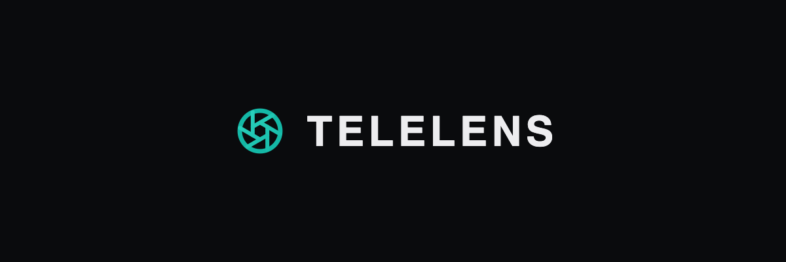
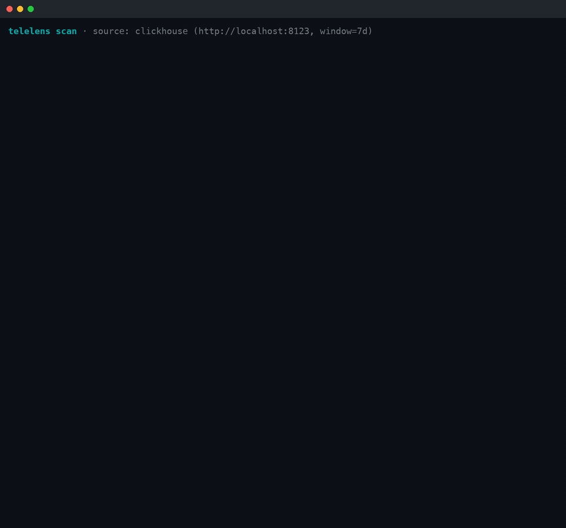
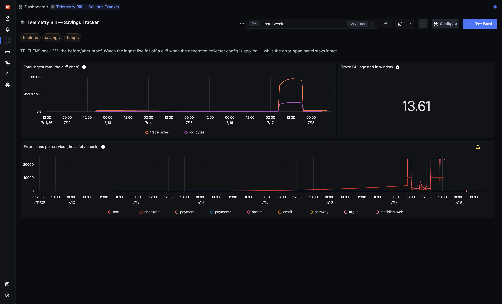
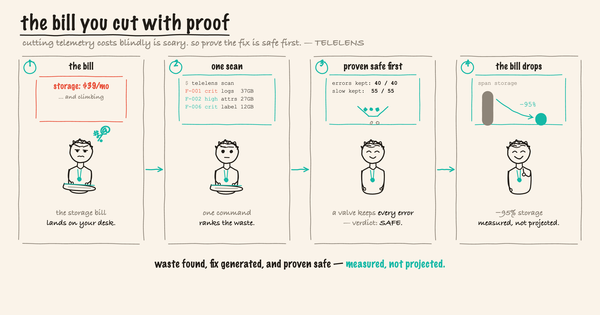

<div align="center">



# TELELENS

**A telemetry cost & cardinality profiler for SigNoz: it finds the waste, generates the fix, and proves it drops zero error traces first.**

**−95.0% span storage measured on a live ingester** (honest counterweight: only **~6%** on an error-storm day — the policy refuses to drop errors) · **14.1M spans profiled in 895 ms** · **31 / 31 error traces kept** · **41 tests, 7 packages, 86 subtests** · **read-only by design** · **MIT**

[](LICENSE)
[](go.mod)
[](https://github.com/vinayaksonthalia/telelens/commits)
[](https://github.com/vinayaksonthalia/telelens)

[See it work](#see-it-work) · [Why TELELENS](#why-telelens) · [The 15-minute tour](#the-15-minute-tour) · [Quickstart](#quickstart) · [Profilers](#what-the-profilers-find) · [Query Builder](#query-builder-coverage) · [Safety proof](#the-safety-proof) · [Architecture](#architecture) · [Status](#honest-status) · [Learn](#learn)

</div>

## See it work

Point TELELENS at a SigNoz instance and it tells you — with evidence, GB/month, and dollars — which telemetry is burning your storage and which nobody ever queries, then generates the OpenTelemetry Collector config that fixes it.

<p align="center">
  
</p>

One command, 895 ms, against a live SigNoz instance holding 14.1M spans: six profilers, a ranked bill, and a replay of the recommended sampling policy over 75,586 real traces that keeps 100% of error and slow traces. Nothing was written to the cluster. *(Real recording, real timings — [`assets/live-scan-2026-07-25.txt`](assets/live-scan-2026-07-25.txt) is the console capture it was rendered from.)*

The **Savings Tracker** dashboard is the other half of the proof: watch ingest fall off a cliff when the generated config lands, while the error-span panel stays flat.

[](assets/screenshots/m5-03-savings-tracker.png)

**Measured, not projected** — applied to a live SigNoz ingester, then reverted and the revert verified:

| Result | Measured | Evidence |
|---|---|---|
| Span storage cut on healthy known-volume traffic | **−95.0%** | [`assets/live-apply-measure-m4-evidence.md`](assets/live-apply-measure-m4-evidence.md) |
| Injected error traces kept | **31 / 31** (live) · **40 / 40** (fixtures) | same |
| Simulator replayed over real last-24h traces | **162,760 traces — SAFE** | [`assets/live-simulator-m3-evidence.txt`](assets/live-simulator-m3-evidence.txt) |
| Honest counterweight: droppable on an error-storm day | **~6%** (the policy refuses to drop errors) | [DOCS §Honest caveats](DOCS.md) |

```
$ telelens scan --fixtures

ID     SEV      CATEGORY  FINDING                                                       GB/MO     $/MO
──────────────────────────────────────────────────────────────────────────────────────────────────────
F-001  critical logs      DEBUG-log firehose from catalog is 50% of your log volume      37.0    11.10
F-002  high     traces    Jumbo attribute catalog.db.statement averages 4200 bytes …     27.5     8.26
F-006  critical metrics   Label "user_id" on "http_server_duration" explodes it to …     12.6     3.79
...
Total identified savings: 130.2 GB/month ≈ $39.06/month

Sampling simulator replay (1195 traces, 3976 spans)
  error traces:  40 / 40 kept
  slow traces:   55 / 55 kept
  boring traces: 53 / 1100 kept (95.2% dropped)
  verdict: SAFE — policy retains 100% of error traces and 100% of slow traces
```

## Why TELELENS

The storage bill lands and it's climbing. Cutting telemetry blindly is scary — drop the wrong span and you're blind during the next incident. TELELENS is observability *for* your observability: it ranks the waste with hard numbers, generates the exact Collector config that fixes it, and **proves with a replay that the fix keeps every error and slow trace before you ever apply it.** It writes files to `out/` and never touches your cluster — a human reviews the diff and runs `foundryctl cast`.

## The story

<p align="center">
  
</p>

## The 15-minute tour

Copy-pasteable, in order. **Steps 1–6 need no SigNoz, no Docker, no network** — the whole
product runs against the committed fixture corpus. The live path (7–8) is optional.

**1. Clone and build** — one static binary, one non-stdlib dependency.

```bash
git clone https://github.com/vinayaksonthalia/telelens
cd telelens
go build -o telelens ./cmd/telelens
```
> *Expect:* no output. `./telelens --help` lists `scan`, `simulate`, `report`, `generate`.

**2. Prove the suite is green** — offline, no fixtures of the "mock the thing under test" kind.

```bash
go test ./...
```
> *Expect:* `ok` for 7 packages (41 tests, 86 including subtests), including
> `TestSimulateSafetyInvariant` in `internal/analyze`.

**3. Find the waste** — the ranked bill, in colour, in well under a second.

```bash
./telelens scan --fixtures
```
> *Expect:* six profilers reporting in, then a severity-coloured table
> (`F-001 critical logs DEBUG-log firehose from catalog is 50% of your log volume  37.0  11.10`),
> ending in `Total identified savings: 130.2 GB/month ≈ $39.06/month` and
> `scan completed in 6ms · outputs in out/`.

**4. Prove the fix is safe** — before anything is applied, the policy is replayed trace by trace.

```bash
./telelens simulate --fixtures --sample-pct 5 --latency-ms 750
```
> *Expect:* `error traces: 40 / 40 kept`, `slow traces: 55 / 55 kept`,
> `boring traces: 53 / 1100 kept (95.2% dropped)`, and
> `verdict: SAFE — policy retains 100% of error traces and 100% of slow traces`.
> The verdict is binary: a policy that would drop **one** error or slow trace prints UNSAFE and
> exits non-zero. That the generator can never emit such a policy is itself asserted by
> `TestSimulateSafetyInvariant` (`internal/analyze/simulator_test.go`), which sweeps trace sets
> across error and slow-trace counts looking for a counter-example.

**5. Read the generated fix** — this is the artifact you'd actually merge.

```bash
./telelens report   --findings out/findings.json    # re-renders out/waste-report.md
./telelens generate --findings out/findings.json    # re-renders the collector fragment + casting patch
sed -n '40,60p' out/collector-fragment.yaml
```
> *Expect:* `wrote out/waste-report.md`, then `wrote out/collector-fragment.yaml` /
> `wrote out/casting-patch.yaml`. In the fragment, the `filter/drop_unread_metrics` block ships
> **deliberately commented out** under the banner
> `# REVIEW BEFORE ENABLING — this block is deliberately commented out.` — "unread" can only see
> SigNoz dashboards and alert rules, never external consumers. The review step is the product.

**6. Take the agent surface** — the same findings as stable JSON on stdout (progress goes to stderr).

```bash
./telelens scan --fixtures --json | jq '.findings[] | select(.category=="quality")'
```
> *Expect:* well-formed JSON objects. `NO_COLOR=1 ./telelens scan --fixtures | cat` degrades cleanly too.

**7. (Optional) Point it at your own SigNoz** — read-only: ClickHouse `SELECT`s and SigNoz `GET`s only.

```bash
cp .env.example .env    # CLICKHOUSE_HTTP_URL, SIGNOZ_API_URL, SIGNOZ_API_KEY, COST_PER_GB
set -a; source .env; set +a
./telelens scan --window 7 --cost-per-gb 0.30
```
> *Expect:* `telelens scan · source: clickhouse (…, window=7d)` and a real ranked bill.
> The Foundry compose does not publish ClickHouse's `:8123` — see
> [DOCS §Path 2](DOCS.md) for the one-line `socat` proxy (or run inside `signoz-network`),
> plus the least-privilege `telelens_ro` user. SigNoz Cloud does not expose ClickHouse, so
> live mode is self-hosted only.

**8. (Optional) Import the dashboards and guardrails.**

```bash
export SIGNOZ_URL=http://localhost:8080 SIGNOZ_API_KEY=...
./dashboards/import.sh
```
> *Expect:* 3 dashboards + 3 alert rules created. The **Savings Tracker** is where the ingest
> cliff shows up after a fix lands, with the error-span panel staying flat beside it.

**Where the flagship proof lives.** The −95.0% is a measured apply → measure → revert run on a
live ingester, not a projection — full protocol, both measurement windows, the 31/31 error-trace
check, the unchanged RED metrics, the verified revert, **and the honest counterweight** (on an
error-storm day the same policy can only drop ~6%, because it refuses to drop errors) are in
[`assets/live-apply-measure-m4-evidence.md`](assets/live-apply-measure-m4-evidence.md).
The console capture behind the recording above is
[`assets/live-scan-2026-07-25.txt`](assets/live-scan-2026-07-25.txt); the whole-instance simulator
replay is [`assets/live-simulator-m3-evidence.txt`](assets/live-simulator-m3-evidence.txt);
[`assets/README.md`](assets/README.md) indexes the rest.

## Quickstart

Requires Go ≥ 1.24. Single static binary; the only non-stdlib dependency is charmbracelet/lipgloss for the design-system terminal output.

```bash
git clone https://github.com/vinayaksonthalia/telelens
cd telelens
go build ./cmd/telelens

# Demo mode — no SigNoz needed. Scans the committed "Noisy Neighborhood"
# fixture corpus (every classic waste pattern, recorded as query results):
./telelens scan --fixtures

# Outputs land in out/:
#   waste-report.md          ranked findings with evidence, GB/mo and $
#   findings.json            machine-readable report
#   collector-fragment.yaml  annotated otelcol processors (tail_sampling, filter, transform)
#   casting-patch.yaml       the same fix as a Foundry ingester.config.data patch
```

Once the repo is public, `go install github.com/vinayaksonthalia/telelens/cmd/telelens@latest` installs the CLI directly.

<details>
<summary><b>Live mode & SigNoz Cloud</b></summary>

```bash
cp .env.example .env         # fill in ClickHouse + SigNoz API settings
set -a; source .env; set +a
./telelens scan --window 7 --cost-per-gb 0.30
```

Live mode needs the ClickHouse HTTP port (`8123`) reachable — the default Foundry compose doesn't publish it, so add it to the `telemetrystore` service or run TELELENS inside `signoz-network`. On startup TELELENS feature-detects the SigNoz schema (`signoz_index_v3` / `logs_v2` / `time_series_v4`) and refuses unrecognized versions with a clear error.

**SigNoz Cloud** doesn't expose ClickHouse to customers, so live mode is self-hosted only; Cloud users run the full fixtures demo, which exercises every profiler and generator against the recorded corpus.
</details>

Re-render from a previous scan without re-profiling: `./telelens report --findings out/findings.json` and `./telelens generate --findings out/findings.json`. Everything runs offline via `go test ./...` (41 tests across 7 packages; 86 incl. subtests).

## What the profilers find

| Profiler | Findings |
|---|---|
| **traces** | volume+bytes by service · attribute cardinality offenders (`user.id` as a span attribute) · jumbo attributes (4 KB `db.statement` on every span) · near-duplicate success spans (tail-sampling candidates) |
| **logs** | Drain-style template mining ("this one DEBUG line is half your log bytes") · per-service severity distribution · exact-duplicate line detection |
| **metrics** | per-metric series cardinality · **which label** is the bomb (`user_id` → 210k series) · stale/silent metrics |
| **usage-xref** | metrics **written but read by no dashboard or alert** — diffed against `GET /api/v1/dashboards` + `GET /api/v1/rules`, walked across schema versions |
| **quality** | missing `service.name` · missing/non-standard/miscased log severity · non-conformant metric names — unqueryable data is waste at any size |
| **ecosystem** | cost attribution for modern workloads: prices AI-agent telemetry (`gen_ai.*` spans + tokens) and browser-RUM sessions (`session.id` spans, KB/session); flags any unbounded ID used as a **metric label** as structural at ANY series count |

Pricing is deliberately transparent: uncompressed-ingest bytes extrapolated to 30 days × `--cost-per-gb` (default $0.30), with documented envelope constants (`internal/analyze/pricing.go`). Findings that can't be priced reliably ship as **directional** (no hard $).

## Query Builder coverage

SigNoz's ideas board has six Query Builder showcase cards; TELELENS exercises each capability in service of a real analysis — not a demo for its own sake.

| Card | Capability | Where it's used |
|---|---|---|
| #11673 | boolean search, EXISTS / NOT EXISTS | Cardinality Explorer "BOTH tracking IDs" panel; usage-xref is NOT-EXISTS over stored vs referenced metrics |
| #11674 | JSON body paths | log profiler's body mining; body-path filters in the debug-logs panel |
| #11675 | hasAll array search | span-events array filter in Cardinality Explorer |
| #11676 | sumIf / count_distinct / rate | `rate` on meter metrics; `count_distinct` on attributes; `countIf` in the duplicate-span profiler |
| #11677 | cross-context group-by + having | every profiler query (`GROUP BY … HAVING …`); dashboards group by resource attributes |
| #11678 | order-by + limit | every profiler query ends `ORDER BY <cost> DESC LIMIT n` — the Waste Report *is* an order-by over money |

Queries Q1–Q12 are defined in `internal/store/store.go`; their raw-ClickHouse SQL forms live in `internal/store/clickhouse.go`.

## The safety proof

Recommending sampling without proving it safe is malpractice. Before TELELENS emits a `tail_sampling` policy it replays it over real trace summaries (24 h live, the fixture set offline): keep all errors, keep everything over the latency threshold, hash-sample the rest deterministically. The verdict is binary — a policy that would drop **one** error or slow trace is rejected and `telelens simulate` exits non-zero. The invariant is enforced by tests (`internal/analyze/simulator_test.go`, `TestSimulateSafetyInvariant`).

```bash
./telelens simulate --fixtures --sample-pct 5 --latency-ms 750
```

## Architecture

```
      ClickHouse :8123 ──SELECT only──┐            ┌── SigNoz API :8080 (GET only)
                                      ▼            ▼
                       ┌──────────── telelens (Go, one binary) ───────────┐
                       │ store: TelemetryStore ── clickhouse | fixtures   │
                       │ profilers: traces · logs · metrics · usage-xref  │
                       │            · data-quality · ecosystem            │
                       │ analyzers: Drain template miner · pricing ·      │
                       │            tail-sampling simulator (safety proof) │
                       │ generators (only writes = files in out/):        │
                       │   waste-report.md · findings.json                │
                       │   collector-fragment.yaml · casting-patch.yaml   │
                       └──────────────────────────────────────────────────┘
                                      │
                       human reviews out/, merges the casting patch,
                       runs `foundryctl cast` — TELELENS never applies anything
```

**Read-only by design (the product invariant).** Profilers issue only ClickHouse `SELECT`s and SigNoz `GET`s; the live client refuses non-SELECT statements in code, and `.env.example` documents the least-privilege `telelens_ro` ClickHouse user that enforces it at the database. The only writes are files in `out/`. (Foundry is SigNoz's official deployment tool — [github.com/SigNoz/foundry](https://github.com/SigNoz/foundry); `foundryctl cast` applies a *casting*, its config.)

### Dashboards & guardrail alerts

`dashboards/` ships the three-part **Telemetry Bill** pack (import via SigNoz UI or `POST /api/v1/dashboards`): **Cost Overview** (ingest rate by signal/service, projected monthly $), **Cardinality Explorer** (series counts, label bombs, builder-vs-SQL panels), and the **Savings Tracker** shown above. `alerts/guardrails.json` seeds three rules (ingest-bytes spike, cardinality explosion, log-volume anomaly) so waste can't silently return.

## Honest status

| Scope | Status |
|---|---|
| **P0** — all six profilers, ranked waste report (md+json), config generator (tail_sampling / filter / transform), casting patch, fixture mode, offline test suite | ✅ Done |
| **P1** — sampling simulator with safety invariant, Telemetry Bill dashboard pack + guardrail alerts, usage cross-reference, `--json` agent/MCP surface, design-system CLI | ✅ Done |
| **Live-verified (Jul 18)** — full scan of a real mixed-workload instance (3.74 s, 26 findings); simulator over ALL 162,760 last-24h traces (SAFE); generated config applied to a live ingester measuring **−95.0% span storage with zero error-trace loss** on healthy known-volume traffic (on an error-storm day the same policy can only drop ~6% — it refuses to touch errors), then reverted; 3 dashboards + 3 alert rules via API; MCP data-quality hook demoed with a real agent | ✅ Evidence in [`assets/`](assets/) |
| **P2 / roadmap** — web panel, `--explain` LLM narration, `telelens verify` automated savings assertion, `--import` flag, `otelcol validate` in CI, multi-cluster scan | ❌ Not done |
| **Live-mode caveats** — SigNoz v0.13x schemas with startup drift detection; heavy queries time-sliced + memory-guarded; meter buckets are hourly, so sub-hour A/B measurements count storage rows instead | ⚠️ Known |

## Compatibility & uninstall

**Compatibility:** live-verified against **self-hosted SigNoz v0.132.2** (`signoz_index_v3` / `logs_v2` / `time_series_v4`, with startup drift detection). Live mode is self-hosted only; the fixtures demo runs anywhere.

**Uninstall:** delete the `telelens` binary and the `out/` directory — TELELENS keeps no other state and mutates nothing. If you created the `telelens_ro` ClickHouse user, drop it. Any dashboards or guardrail alerts you imported are removed from the SigNoz UI or via the APIs.

## Learn

A full teaching curriculum lives in [`learning/`](learning/README.md) — the big picture, how the scan/price/generate/prove pipeline works, a SigNoz deep-dive (ClickHouse schemas, the two query dialects, the metric_log OOM), the tech stack and trade-offs, an FAQ (with honest limits and a glossary), the design rationale, and a bug-hunt diary. Start at [`learning/README.md`](learning/README.md).

---

## AI disclosure

AI coding assistants were used during development. The profilers, config generator, sampling simulator, and dashboards are original work; the analysis itself is deterministic SQL and arithmetic — there is no LLM in the cost loop — and every live number in this README is backed by evidence under [`assets/`](assets/).

<div align="center"><sub>Built for the SigNoz observability ecosystem · observability for your observability.</sub></div>
