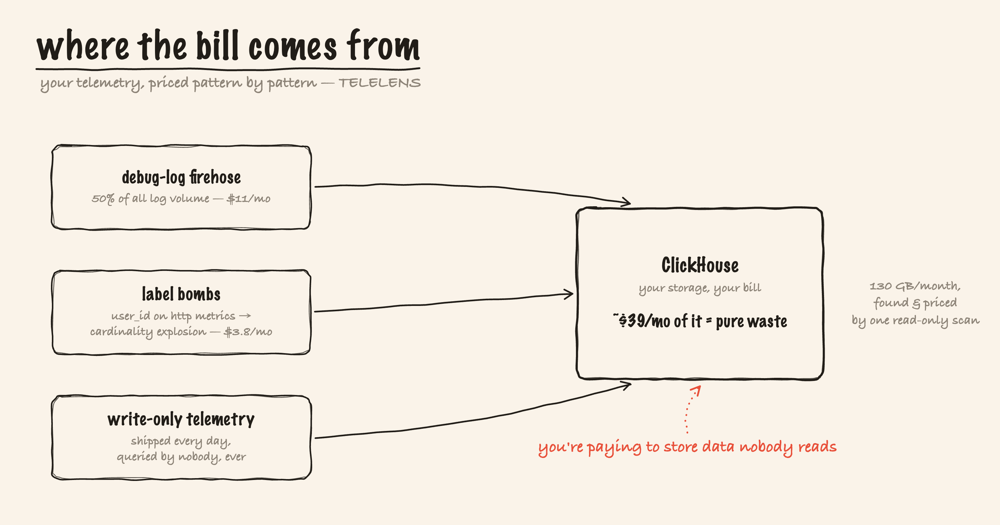

<div align="center">


# TELELENS

**Telemetry cost & cardinality profiler for SigNoz — finds waste, generates fixes, proves them safe first.**

[](LICENSE)


</div>

Point it at a SigNoz instance and it tells you — with evidence, GB/month, and dollars — which
services, attributes, log templates and metric labels are burning your storage, which telemetry
nobody ever queries, and then **generates the OpenTelemetry Collector config that fixes it**, with
a sampling simulator that proves the fix loses zero error traces. Observability *for* your
observability.



**Measured, not projected:** applied to a live SigNoz ingester, the generated config cut span
storage **95.0%** on healthy known-volume traffic while keeping **31/31** injected error traces
and leaving RED metrics untouched — then was reverted and the revert verified
(`assets/live-apply-measure-m4-evidence.md`). The honest counterweight: on an error-storm day the
same replay reports only **~6%** droppable, because the policy refuses to drop errors — that
refusal is the feature (see DOCS §Honest caveats).

```
$ telelens scan --fixtures

ID     SEV      CATEGORY  FINDING                                                       GB/MO     $/MO
──────────────────────────────────────────────────────────────────────────────────────────────────────
F-001  critical logs      DEBUG-log firehose from catalog is 50% of your log volume      37.0    11.10
F-002  high     traces    Jumbo attribute catalog.db.statement averages 4200 bytes …     27.5     8.26
F-005  high     traces    2010000 near-identical success spans are prime tail-sampl…     13.0     3.89
F-006  critical metrics   Label "user_id" on "http_server_duration" explodes it to …     12.6     3.79
F-017  low      traces    AI-agent telemetry bill: "argus" ships 35 gen_ai spans (2…      0.0     0.00
F-019  high     metrics   Unbounded ID "session.id" is a metric label on browser.se…        —        —
...
Total identified savings: 130.2 GB/month ≈ $39.06/month

Sampling simulator replay (1195 traces, 3976 spans)
  error traces:  40 / 40 kept
  slow traces:   55 / 55 kept
  boring traces: 53 / 1100 kept (95.2% dropped)
  verdict: SAFE — policy retains 100% of error traces and 100% of slow traces
```

## Architecture

```
      ClickHouse :8123 ──SELECT only──┐            ┌── SigNoz API :8080 (GET only)
                                      ▼            ▼
                       ┌──────────── telelens (Go, one binary) ───────────┐
                       │ store: TelemetryStore ── clickhouse | fixtures   │
                       │ profilers: traces · logs · metrics · usage-xref  │
                       │            · data-quality (ideas-board #11666)   │
                       │ analyzers: Drain template miner · pricing ·      │
                       │            tail-sampling simulator (NFR-4 proof) │
                       │ generators (only writes = files in out/):        │
                       │   waste-report.md · findings.json                │
                       │   collector-fragment.yaml · casting-patch.yaml   │
                       └──────────────────────────────────────────────────┘
                                      │
                       human reviews out/, merges the casting patch,
                       runs `foundryctl cast` — TELELENS never applies anything
```

**Read-only by design (the product invariant).** Profilers issue only ClickHouse `SELECT`s and
SigNoz `GET`s. The live client refuses non-SELECT statements in code, and `.env.example` documents
the least-privilege `telelens_ro` ClickHouse user that enforces it at the database. The only writes
TELELENS performs are files in `out/`; applying them is always a human running `foundryctl cast`.
(Foundry is SigNoz's official deployment tool — [github.com/SigNoz/foundry](https://github.com/SigNoz/foundry);
a *casting* is its config, and `foundryctl cast` applies it.)

## Quickstart

Requires Go ≥ 1.24. Single static binary; the only non-stdlib dependency is
charmbracelet/lipgloss for the design-system terminal output. Distribution today is
**clone and `go build`**, and — because the module path is
`github.com/vinayaksonthalia/telelens` — `go install github.com/vinayaksonthalia/telelens/cmd/telelens@latest`
once the repository is public. Licensed MIT (see `LICENSE`).

```bash
# Build from source
git clone https://github.com/vinayaksonthalia/telelens
cd telelens
go build ./cmd/telelens

# …or, once the repository is public, install the CLI directly:
#   go install github.com/vinayaksonthalia/telelens/cmd/telelens@latest

# Demo mode — no SigNoz needed. Scans the committed "Noisy Neighborhood"
# fixture corpus (every classic waste pattern, recorded as query results):
./telelens scan --fixtures

# Outputs land in out/:
#   waste-report.md          ranked findings with evidence, GB/mo and $
#   findings.json            machine-readable report
#   collector-fragment.yaml  annotated otelcol processors (tail_sampling,
#                            filter, transform), one block per finding
#   casting-patch.yaml       the same fix as a Foundry ingester.config.data patch

# Replay a tail-sampling policy and print the safety proof:
./telelens simulate --fixtures --sample-pct 5 --latency-ms 750

# Re-render from a previous scan without re-profiling:
./telelens report   --findings out/findings.json
./telelens generate --findings out/findings.json
```

### Live mode

```bash
cp .env.example .env         # fill in ClickHouse + SigNoz API settings
set -a; source .env; set +a
./telelens scan --window 7 --cost-per-gb 0.30
```

Live mode needs the ClickHouse HTTP port reachable (the default Foundry compose does not publish
`8123` to the host — add it to the `telemetrystore` service ports, or run telelens inside the
`signoz-network`). On startup TELELENS feature-detects the SigNoz schema
(`signoz_index_v3` / `logs_v2` / `time_series_v4`) and refuses unrecognized versions with a clear
error instead of guessing.

## What the profilers find

| Profiler | Findings |
|---|---|
| **traces** | volume+bytes by service · attribute cardinality offenders (`user.id` as a span attribute) · jumbo attributes (4 KB `db.statement` on every span) · near-duplicate success spans (health-check spam → tail-sampling candidate) |
| **logs** | Drain-style template mining ("this one DEBUG line is half your log bytes") · per-service severity distribution · exact-duplicate line detection |
| **metrics** | per-metric series cardinality · **which label** is the bomb (`user_id` → 210k series) · stale/silent metrics |
| **usage-xref** | metrics **written but read by no dashboard or alert** — diffed against `GET /api/v1/dashboards` + `GET /api/v1/rules`, walked defensively across schema versions |
| **quality** | (subsumes ideas-board #11666) missing `service.name` · missing/non-standard/miscased log severity · non-conformant metric names — unqueryable data is waste at any size |
| **ecosystem** | cost attribution for modern workloads: prices AI-agent telemetry (`gen_ai.*` spans + tokens tracked) and browser-RUM sessions (`session.id` spans, KB/session) · the cardinality-discipline check: an unbounded ID (session/user/request id) used as a **metric label** is flagged as structural at ANY series count, and IDs correctly kept off metrics earn a positive finding |

Pricing is deliberately transparent: uncompressed-ingest bytes, extrapolated from the scan window
to 30 days, times `--cost-per-gb` (default $0.30). Simple envelope constants
(300 B/span, 150 B/log record, 32 B/metric sample) are documented in `internal/analyze/pricing.go`.
Findings that can't be priced reliably ship as **directional** (no hard $).

## The sampling simulator (the safety proof)

Recommending sampling without proving safety is malpractice. Before TELELENS emits a
`tail_sampling` policy it replays it over real trace summaries (24 h in live mode, the fixture set
offline): keep all errors, keep everything over the latency threshold, hash-sample the rest
deterministically. The verdict is binary: a policy that would drop **one** error or slow trace is
rejected (`telelens simulate` exits non-zero). This invariant is enforced by tests
(`internal/analyze/simulator_test.go`, `TestSimulateSafetyInvariant`).

## Dashboard pack & guardrail alerts

`dashboards/` ships the three-part **Telemetry Bill** pack (importable via SigNoz UI → Dashboards
→ Import JSON, or `POST /api/v1/dashboards`):

1. **Cost Overview** — ingest rate by signal/service from the `signoz.meter.*` usage metrics,
   projected monthly $ via a `$cost_per_gb` variable.
2. **Cardinality Explorer** — series counts, label bombs, attribute cardinality; mixes v5 builder
   panels with raw-ClickHouse panels (the "builder vs SQL" theme).
3. **Savings Tracker** — the before/after cliff chart, an error-visibility safety panel, and a
   GB-avoided counter.

`alerts/guardrails.json` seeds three rules (ingest-bytes spike, cardinality explosion, log-volume
anomaly) so waste can't silently return after a cleanup.

## Query Builder capability mapping

SigNoz's ideas board has six Query Builder showcase cards; TELELENS exercises each capability in
service of a real analysis:

| Card | Capability | Where |
|---|---|---|
| #11673 | boolean search, EXISTS / NOT EXISTS | Cardinality Explorer "BOTH tracking IDs" panel; Cost Overview debug-logs panel; usage-xref is NOT-EXISTS semantics over stored vs referenced metrics |
| #11674 | JSON body paths | log profiler's body mining is the raw-SQL twin; body-path filters in the debug-logs panel |
| #11675 | hasAll array search | span-events array filter noted in Cardinality Explorer panel description |
| #11676 | sumIf / count_distinct / rate | `rate` on meter metrics (Cost Overview, Savings Tracker); `count_distinct` on attributes (Cardinality Explorer); `countIf` in the duplicate-span profiler SQL |
| #11677 | cross-context group-by + having | every profiler query (`GROUP BY … HAVING …`); dashboards group point data by resource attributes |
| #11678 | order-by + limit | every profiler query ends `ORDER BY <cost> DESC LIMIT n` — the Waste Report *is* an order-by over money |

The queries Q1–Q12 are defined in `internal/store/store.go` (row types + the Q-numbering);
their raw-ClickHouse SQL forms live in `internal/store/clickhouse.go`.

## Testing

```bash
go test ./...
```

Everything runs offline: table-driven unit tests for the Drain miner, pricing math, and simulator
(including the NFR-4 safety battery); profiler tests over the fixture corpus asserting each
engineered waste pattern is found (and healthy telemetry is *not* flagged); golden-file tests for
the generated collector fragment and casting patch (`testdata/golden/`, refresh with
`go test ./internal/generate -update`); and a SELECT-only-guard test for the live client.

## Honest status

- **Done (P0):** all six profilers (traces/logs/metrics/usage-xref/ecosystem/quality), ranked
  waste report (md+json), config generator (tail_sampling / filter / transform, annotated per
  finding), casting patch variant, fixture mode, offline test suite (41 tests across 7 packages; 86 incl. subtests).
- **Done (P1):** sampling simulator with safety invariant, Telemetry Bill dashboard pack +
  guardrail alerts with parameterized channel (`dashboards/import.sh`), usage cross-reference,
  `--json` agent/MCP surface, design-system CLI (lipgloss, NO_COLOR-safe, `Error:/Why:/Try:`).
- **LIVE-VERIFIED (Jul 18, evidence in `assets/`):** full scan of a real mixed-workload instance
  (3.9 s, 26 findings incl. pricing two sibling projects' telemetry); simulator replayed over ALL
  162,760 real last-24h traces (SAFE); generated config applied to the live ingester and
  **measured −95.0% span storage with zero error-trace loss** on a healthy traffic mix (the same
  replay on an error-storm day honestly reports ~6% — the policy refuses to drop errors), then
  reverted; 3 dashboards + 3
  alert rules live via API with real data; the MCP data-quality hook demoed with a real agent.
- **Not done (P2 / roadmap):** web panel, `--explain` LLM narration (the analysis itself is
  deterministic SQL + math — an LLM would only narrate), `telelens verify` automated
  measured-savings assertion, `--import` flag, `otelcol validate` in CI, multi-cluster scan.
- **Live mode caveats:** SigNoz v0.13x schemas with startup drift detection; heavy queries are
  time-sliced + memory-guarded (learned live — see `LEARNINGS.md`); meter buckets are hourly, so
  sub-hour A/B measurements count storage rows instead.

## Learn

A full teaching curriculum lives in [`learning/`](learning/README.md) — the big
picture, how the scan/price/generate/prove pipeline works, a SigNoz deep-dive
(ClickHouse schemas, the two query dialects, the metric_log OOM), the tech stack
and trade-offs, an FAQ (with honest limits and a glossary), the design rationale,
and a bug-hunt diary. Start at
[`learning/README.md`](learning/README.md).

## A note on how this was built

AI coding assistants were used during development. The profilers, config generator, sampling
simulator, and dashboards are original work; the analysis itself is deterministic SQL and
arithmetic — there is no LLM in the cost loop — and every live number in this README is backed by
evidence under [`assets/`](assets/).
