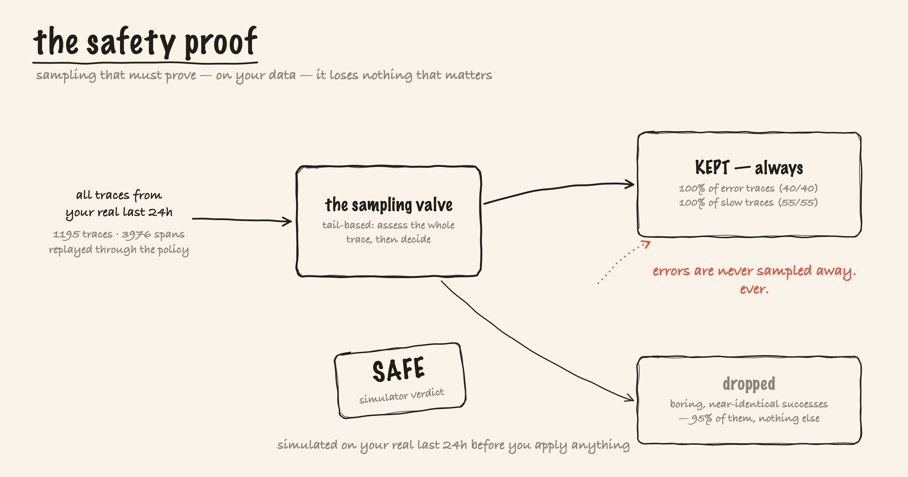

# How It Works — scan, price, generate, prove

**In one line:** One read-only store feeds six profilers that find waste, an analyzer layer prices it in dollars and mines log templates, a generator writes the collector config that fixes it, and a simulator replays that fix over your real traces to prove it's safe — all before a human applies anything.

---

## ELI10

Think of TELELENS as a home energy auditor. It walks through your house (reads your telemetry, looking only, touching nothing), notes every draft and every light left on, and hands you a report that says *"this one leaky window costs you $11 a month."* Then it doesn't just leave the list — it drafts the exact repairs. And before you pay a contractor, it runs a simulation proving the repairs won't accidentally seal your front door shut. You, the homeowner, decide what to actually fix. The auditor never picks up a hammer.

---

## The whole flow on one page


```
      ClickHouse :8123 ──SELECT only──┐            ┌── SigNoz API :8080 (GET only)
                                      ▼            ▼
                       ┌──────────── telelens (Go, one binary) ───────────┐
                       │ store: TelemetryStore ── clickhouse | fixtures   │
                       │ profilers: traces · logs · metrics · usage-xref  │
                       │            · data-quality · ecosystem            │
                       │ analyzers: Drain template miner · pricing ·      │
                       │            tail-sampling simulator (safety proof)│
                       │ generators (only writes = files in out/):        │
                       │   waste-report.md · findings.json                │
                       │   collector-fragment.yaml · casting-patch.yaml   │
                       └──────────────────────────────────────────────────┘
                                      │
                       human reviews out/, merges the fix, applies it —
                       TELELENS never applies anything
```

---

## Step 1 — one store, two backends

Everything reads through a single `TelemetryStore` interface with two implementations: `fixtures` (a committed "Noisy Neighborhood" corpus of recorded query results — every classic waste pattern, no SigNoz needed) and `clickhouse` (a live instance). This one seam is why every profiler runs identically offline and live, and why every live bug we hit landed *in the store*, not in a profiler. On startup in live mode, the store **feature-detects the SigNoz schema** (`signoz_index_v3` / `logs_v2` / `time_series_v4`) and *refuses unrecognized versions with a clear error* rather than guessing.

**Read-only by construction:** the live client refuses any non-`SELECT` statement in code, and `.env.example` documents a least-privilege `telelens_ro` ClickHouse user that enforces it at the database. The only writes the profiler performs are files in `out/` — the one exception is the opt-in `dashboards/import.sh`, which POSTs the dashboard pack and guardrail rules only when you run it.

---

## Step 2 — six profilers find the waste

Each profiler is a set of raw ClickHouse `SELECT`s (all ending `ORDER BY <cost> DESC LIMIT n` — the Waste Report *is* an order-by over money):

- **traces** — volume+bytes by service; attribute-cardinality offenders (`user.id` on a span); jumbo attributes (a 4 KB `db.statement` on every span); near-duplicate success spans (health-check spam → a tail-sampling candidate).
- **logs** — Drain-style template mining ("this one DEBUG line is half your log bytes"); per-service severity distribution; exact-duplicate detection.
- **metrics** — per-metric series cardinality, *which label* is the bomb (`user_id` → 210k series), and stale/silent metrics.
- **usage-xref** — metrics **written but read by no dashboard or alert**, diffed against `GET /api/v1/dashboards` + `GET /api/v1/rules`. (This is NOT-EXISTS semantics: stored-but-never-referenced.)
- **quality** — missing `service.name`, missing/miscased log severity, non-conformant metric names. *Unqueryable data is waste at any size.* (This subsumes the official idea-board card #11666.)
- **ecosystem** — cost attribution for modern workloads: it prices AI-agent telemetry (`gen_ai.*` spans + tokens) and browser-RUM sessions, and runs the *cardinality-discipline check* — an unbounded ID (session/user/request) used as a **metric label** is flagged as structural at *any* series count, and IDs correctly kept off metrics earn a *positive* finding.

---

## Step 3 — the Drain template miner

Logs are messy, but they're messy in patterns. The **Drain** algorithm clusters log lines into templates by treating variable bits (numbers, IDs, hex) as wildcards, so `user 4821 timed out` and `user 9930 timed out` collapse into one signature `user <*> timed out`. That's what lets TELELENS say "this *one template* is half your log bytes" instead of drowning you in individual lines. It's a deterministic, table-tested miner — no LLM.

---

## Step 4 — price it, transparently

Every finding is priced in uncompressed-ingest bytes, extrapolated from the scan window to 30 days, times `--cost-per-gb` (default $0.30). The envelope constants are documented in the open (300 B/span, 150 B/log record, 32 B/metric sample). Findings that *can't* be priced reliably ship as **directional** (no hard $) rather than inventing a number. The pricing lives in `internal/analyze/pricing.go` — and getting it right against the *live* schema was a real fight (see [02-signoz-deep-dive.md](02-signoz-deep-dive.md): you must price from the table that actually stores the thing).

---

## Step 5 — rank ruthlessly (91 findings is zero findings)

This is a product lesson worth stating: the unread-metrics cross-reference once produced **91 near-identical rows that drowned everything else.** So the report ranks — top offenders priced individually, with a roll-up finding for the long tail. **Ranking is a product feature, not a formatting choice.** A cost report you can't act on is noise.

---

## Step 6 — generate the fix (a proposal, never an action)

The generator writes two forms of the *same* fix, one block per finding, annotated with the finding it addresses and the saving it buys:

- `collector-fragment.yaml` — annotated otelcol processors (`tail_sampling`, `filter`, `transform`).
- `casting-patch.yaml` — the same fix as a Foundry `ingester.config.data` patch.

Two safety rails are baked in. First, the `filter/drop_unread_metrics` block ships **commented-out** behind a review banner — "unread" can only see SigNoz dashboards and alerts, *never external consumers*, so it's a question for a human, not an instruction for a collector. Second, the generated fragment repeats a hard warning: **keep `signozspanmetrics` before `tail_sampling`** in the traces pipeline, or your RED metrics get sampled too. These outputs are golden-file-tested (`testdata/golden/`).

---

## Step 7 — prove it safe (the simulator)

Before you apply anything, `telelens simulate` replays the proposed tail-sampling policy over your real trace summaries (24 h live, the fixture set offline): **keep all errors, keep everything over the latency threshold, hash-sample the rest deterministically.** The verdict is binary — a policy that would drop *one* error or slow trace is **rejected**, and the command exits non-zero. This invariant is enforced by a test (`TestSimulateSafetyInvariant`), so the safety promise is a property of the code, not a claim in a doc.



Live, the simulator replayed all **162,760 real last-24h traces** (8.9M spans) and returned SAFE — every one of 110,597 error traces kept. (The full apply-and-measure story — how we got a measured −95% on healthy traffic — ~6% on an error-storm day — without breaking the sibling projects — is [02-signoz-deep-dive.md](02-signoz-deep-dive.md) and [06-bug-hunt.md](06-bug-hunt.md).)

---

## Step 8 — the human applies it

TELELENS stops at the proposal. A human reviews `out/`, drops the blocks that don't fit their environment (we did — the `drop_unread_metrics` set included live evidence for the sibling projects), backs up the config, applies the fix, and watches the Savings Tracker dashboard for the cliff. **The operator-review step is the product.** A generated config is a proposal, not a command.

---

## Related

- [00-the-big-picture.md](00-the-big-picture.md) — why telemetry-about-telemetry is the missing product.
- [02-signoz-deep-dive.md](02-signoz-deep-dive.md) — the ClickHouse schemas and the live fights behind each step.
- [03-the-tech-stack.md](03-the-tech-stack.md) — Go, the store seam, Drain, the golden-file generators.
- [06-bug-hunt.md](06-bug-hunt.md) — the OOM, the self-contradicting report, and "91 findings is zero findings."
